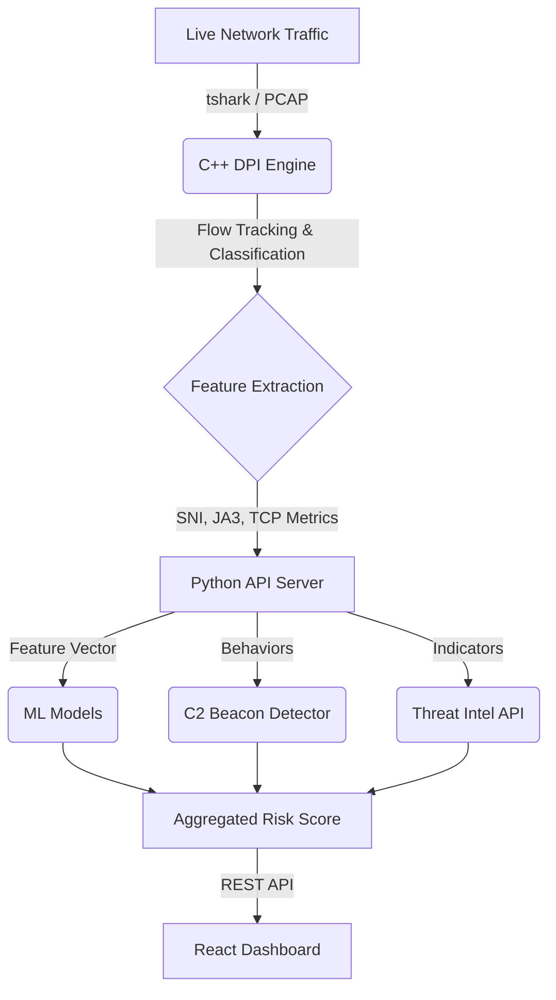

<div align="center">

# 🛡️ CryptGuard
**Privacy-Preserving Encrypted Traffic Threat Detection**

[](https://isocpp.org/)
[](https://www.python.org/)
[](https://react.dev/)
[](LICENSE)

*Analyze metadata and behavior to spot malicious patterns in encrypted traffic—without decrypting a single payload.*

---

**🥈 Runner-Up @ National Level Hackathon** — *Team Limitless*

</div>

## 📖 The Problem & Our Solution
Modern networks are highly encrypted (HTTPS/TLS). Traditional firewalls are blinded by this, while enterprise Deep Packet Inspection (DPI) often requires "Man-in-the-Middle" (MITM) decryption, which violates user privacy and runs afoul of data protection regulations like the **DPDP Act**.

**CryptGuard** solves this by analyzing **metadata only**. Instead of breaking encryption, it inspects:
- Packet sizes & timing patterns
- Flow statistics & behavioral anomalies
- TLS/SNI/JA3 fingerprints
- DNS anomalies & Intelligence

It assigns risk scores and flags suspicious flows (like C2 beaconing) in real-time using Machine Learning and statistical profiling, keeping networks secure while completely respecting user privacy.

---

## ✨ Key Features

* 🚀 **High-Performance C++ DPI Engine**: A multi-threaded, load-balanced packet inspection engine written from scratch in C++. Capable of processing high-volume traffic in real-time.
* 🧠 **Machine Learning Detection Pipeline**: Utilizes Random Forest and XGBoost models trained on 57+ network flow features to classify benign and malicious traffic without payload inspection.
* 📡 **Advanced C2 Beaconing Detection**: 4-signal heuristic engine (FFT periodicity, destination consistency, size uniformity, night activity) to identify hidden Command & Control channels.
* 🌍 **Global Threat Intelligence**: Built-in SQLite caching and integration with AbuseIPDB to verify risk levels of destination IP addresses.
* 📊 **Real-Time React Dashboard**: A sleek, live-updating command center showing real-time traffic flows, DNS intelligence, threat alerts, and process attribution (pid mapping).
* 🔒 **100% Privacy Compliant**: Never inspects the encrypted payload. fully aligns with modern privacy mandates (e.g., DPDP Act).

---

## 🏗️ Architecture



### 1. **DPI Engine (`/Packet_analyzer/src/`)**
Written in modern C++. Multi-threaded architecture with **Load Balancers** distributing packets to **Fast Path (FP)** threads based on consistent 5-tuple hashing. Extracts SNI from TLS Client Hellos, computes JA3 fingerprints, and monitors DNS queries.

### 2. **Analytics Server (`/Packet_analyzer/api_server.py`)**
A Python backend that coordinates the DPI engine, aggregates connection data, runs data through ML models, evaluates heuristic C2 beaconing logic, and maps active network connections to local processes.

### 3. **Command Dashboard (`/Packet_analyzer/web_ui/`)**
A Vite + React application providing a live feed of tracked domains, active threats, DNS anomalies, and historical threat insights.

---

## 🚀 Quick Start & Installation

### Prerequisites
1. **Windows OS** (Primary target)
2. **Wireshark** installed (Ensure `tshark.exe` is at `C:\Program Files\Wireshark\tshark.exe`)
3. **MSYS2** (Installed to `C:\msys64` for running the compiled C++ engine)
4. **Python 3.11+**
5. **Node.js 18+**

### Step 1: Environment Setup
Clone the repo and navigate to the analyzer directory:
```bash
git clone https://github.com/YourOrg/CryptGuard.git
cd CryptGuard/Packet_analyzer
```

Create a `.env` file for Threat Intelligence:
```env
ABUSEIPDB_API_KEY=your_key_here
```

### Step 2: Backend Dependencies (Python)
Install the required machine learning and networking packages:
```bash
pip install -r requirements.txt
```

### Step 3: Frontend Setup (React)
```bash
cd web_ui
npm install
npm run dev
```

### Step 4: Launching CryptGuard
Open a separate terminal and start the main API server:
```bash
cd Packet_analyzer
python api_server.py
```
*Note: Make sure to run this terminal with **Administrator privileges** so tshark can capture live network interfaces and psutil can inspect process IDs.*

Once running, navigate to **`http://localhost:5173`** to access the dashboard!

---

## 🤖 Simulation & Testing

To test the system without waiting for real malware to strike, run the beacon simulator:
```bash
cd Packet_analyzer
python run_sim.py
```
This script injects controlled traffic patterns (like strict 30s interval connections) into the database, triggering the FFT Periodicity and Uniformity rules, and demonstrating the C2 alerts on the dashboard instantly!

---

## 📁 Repository Structure

```text
CryptGuard/
├── Packet_analyzer/                 # Core backend directory
│   ├── src/                         # C++ DPI Engine source files
│   ├── include/                     # C++ Headers
│   ├── model/                       # Serialized ML Models (RF, XGB)
│   ├── web_ui/                      # React Frontend Dashboard
│   ├── api_server.py                # Main Python Controller & REST API
│   ├── beacon_detector.py           # C2 Heuristic Logic
│   ├── threat_intel.py              # AbuseIPDB API Integration
│   ├── live_capture.py              # CLI version of the capture tool
│   ├── run_sim.py                   # Testing simulator
│   └── README.md                    # Deep dive into packet dissection logic
└── README.md                        # You are here
```

> **Deep Dive**: Want to learn exactly how SNI extraction and TLS Handshake parsing work at the byte level? Check out our [Internal Architecture Guide](Packet_analyzer/README.md).

---

## 🛡️ Made by Team Limitless
Mohammad Mulla • Shifa Khan • Muhammad Mitkar • Aleena Khan